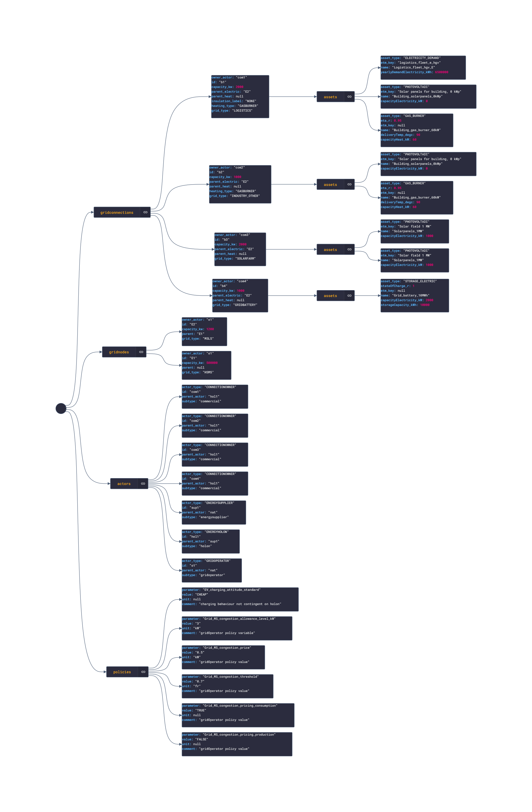

# Experiments module
(works better at the [Github Pages](https://zenmo.github.io/HOLON-cloudclient/))

The experiments module allows you to define your experiment in a config file and run one or
multiple experiments sequentially. No more adjusting classes! Based on the existing scripts.

- [Experiments module](#experiments-module)
  - [Installation](#installation)
    - [Development](#development)
    - [Production](#production)
  - [Starting up](#starting-up)
  - [Running the module](#running-the-module)
  - [Pipenv support](#pipenv-support)
  - [Data classes](#data-classes)
    - [Examples](#examples)

## Installation

### Development
Uses editable wheel build.
```bash
git clone https://github.com/ZEnMo/HOLON-cloudclient.git
cd HOLON-cloudclient
# CREATE AND ACTIVATE YOUR ENV OF CHOICE
pip install -e .
```


### Production
**Direct**
```bash
pip install https://github.com/ZEnMo/HOLON-cloudclient/archive/main.zip
```
**Via requirements.txt**
```
git+https://github.com/ZEnMo/HOLON-cloudclient@main#egg=cloudclient
```

## Starting up

Go to the `config` folder and copy the `config.example.yml` file to `config.yml`. Specify
your secret API key to connect to the AnyLogic Cloud there.
```bash
# ~/run_cloud_experiments
cp ./config/config.example.yml ./config/config.yml
```
Go to the `config` folder and copy the `experiments.example.yml` file to `experiments.yml`. Specify
your experiments there
```bash
# ~/run_cloud_experiments
cp ./config/experiments.example.yml ./config/experiments.yml
```

Next define your experiments in the `experiments.yml` file. There is an example there to help you.

## Running the module

The base code for the module is in the `experiments` folder. But you can easily call the module
from the script `run_experiments` in the `scripts` folder. Here you can run one experiment by
specifying its name or all experiments by using the keyword `ALL`.

## Pipenv support

There is also support for pipenv now for the ones that are interested. There is a shortcut to
run the experiments: `pipenv run experiments {experiment_name}`.


Happy experimenting!

## Data classes

Data classes are used to structure and validate data before it is sent to the AnyLogic API. Find the class diagrams below:

1. [Conversion assets](doc/html/conversion_classes.html)
2. [Consumption assets](doc/html/consumption_classes.html)
3. [Storage assets](doc/html/storage_classes.html)
4. [Production assets](doc/html/production_classes.html)
5. [Grid connections](doc/html/gridconnections_classes.html)
6. [Gridnode assets](doc/html/gridnodes_classes.html)
7. [Actors](doc/html/actors_classes.html)
8. [Contracts](doc/html/contracts_classes.html)

### Examples

Check out the example JSON file over at: [doc/assets/example.json](doc/assets/example.json).

Or inspect the visual representation below:

